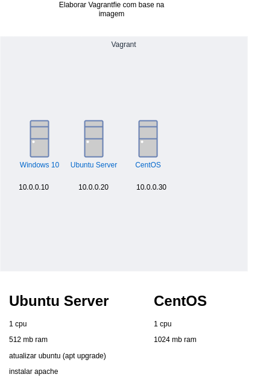
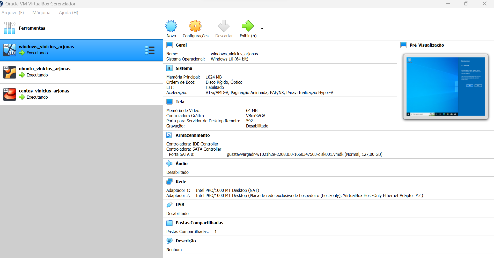
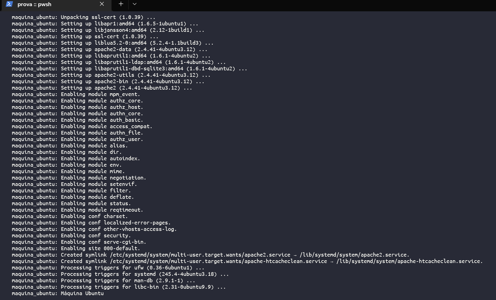
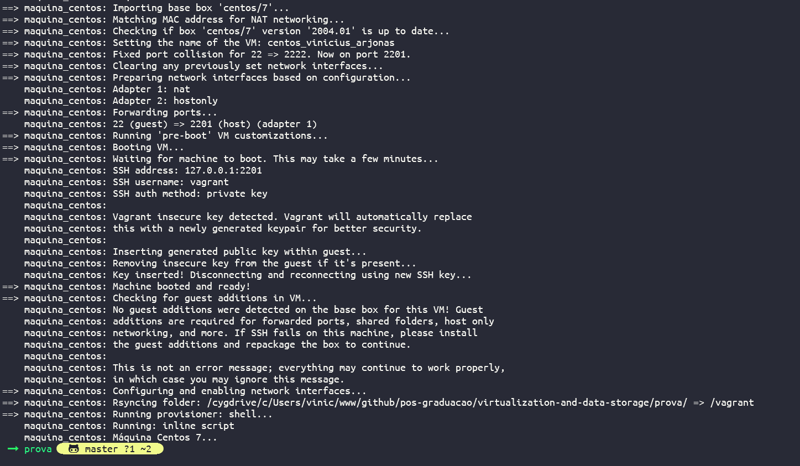
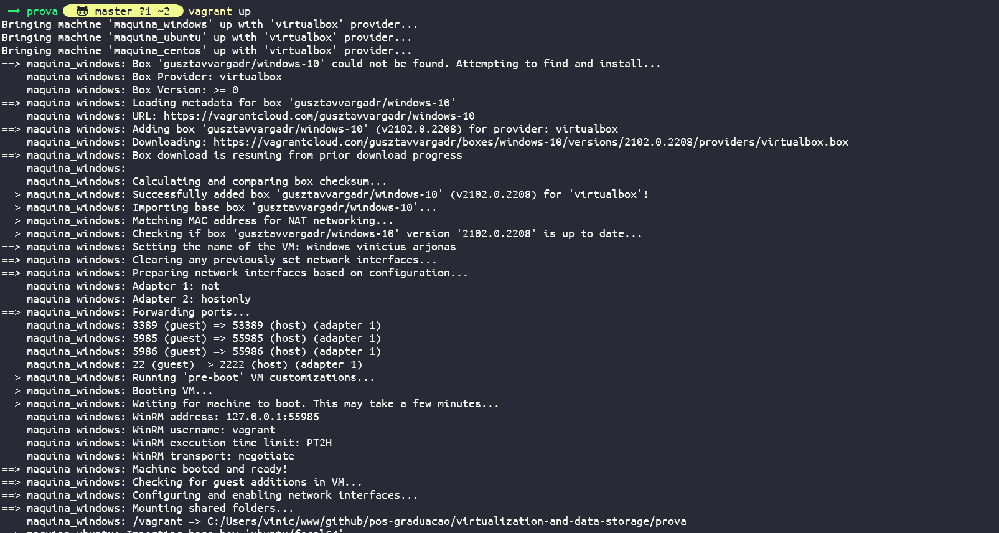

# Prova

Criar 3 máquinas virtuais como a imagem abaixo:




## Resultados

Virtual Box



### Máquina Virtual Ubuntu



Acessando Máquina Virtual Ubuntu

```
vagrant ssh maquina_ubuntu
```

Verificando instalação do Apache após acessar o máquina por ssh
```
sudo systemctl status apache2
```


### Máquina Virtual Cento



Acessando Máquina Virtual Cento
```
vagrant ssh maquina_cento
```

### Máquina Virtual Windows


